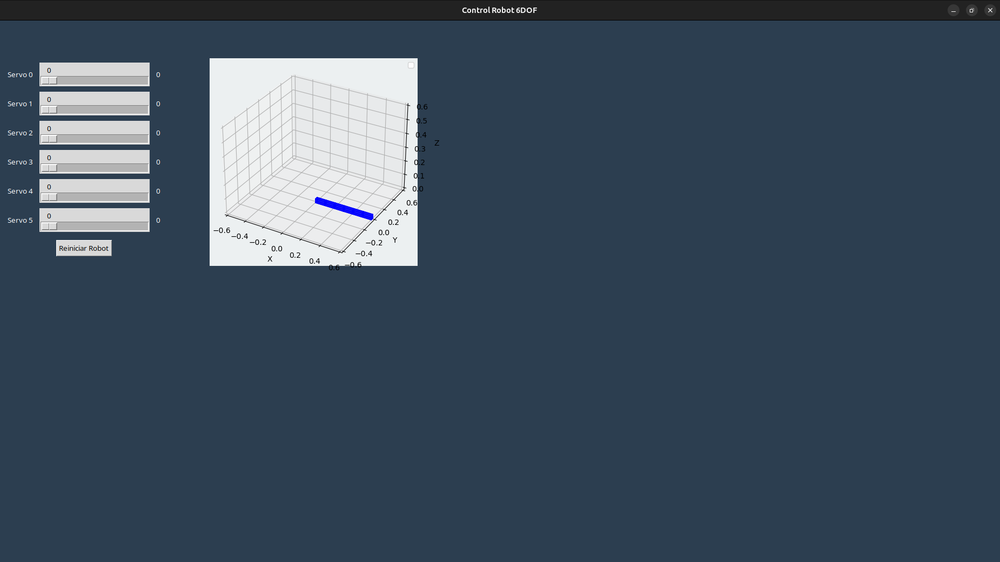

# 🤖 6-DOF Robotic Arm Control System | Python & ROS
**Interfaz de Control Cinemático para Robot Antropomórfico**

Este proyecto integra la potencia de **Python 3.12.3** con el estándar industrial **ROS (Robot Operating System)**. El sistema permite el control preciso de un brazo robótico de 6 grados de libertad mediante una interfaz gráfica, gestionando la comunicación y los nodos desde la terminal de **Linux Ubuntu**.

---

## 📺 Demostración en Video

---

## 🚀 Arquitectura y Diseño de Ingeniería
El software se diseñó bajo una arquitectura de nodos descentralizada, optimizada para ejecutarse en un entorno Linux Ubuntu mediante Visual Studio Code. La arquitectura separa la lógica de procesamiento matemático de la interfaz de usuario, garantizando estabilidad en el control del hardware.

**Core de Programación:** Desarrollado íntegramente en Python 3.12.3, aprovechando las últimas mejoras en rendimiento y gestión de librerías.

**Lógica de Ingeniería:** Implementación de cinemática directa/inversa y matemáticas de matrices de transformación para el cálculo preciso del posicionamiento espacial de los 6 grados de libertad.

**Middleware (ROS):** Utilizado como sistema operativo robótico para la orquestación de mensajes, permitiendo que la terminal de comandos funcione como puente de comunicación síncrona.

**HMI & Control de Actuadores:** Interfaz gráfica interactiva con sliders para el control angular preciso y envío de señales para el manejo de servomotores en tiempo real.

---

## Funcionalidades Técnicas
**Control de Articulaciones:** Deslizadores (sliders) independientes para cada uno de los 6 ejes.

**Cinemática:** Lógica de programación para el cálculo de posiciones y límites de movimiento.

**Comunicación:** Protocolo de envío de datos desde la interfaz hacia los actuadores del robot.

**Interfaz Intuitiva:** Diseño enfocado en la experiencia de usuario (UX) para operarios técnicos.

---

## 📂 Estructura del Proyecto
   **src/control_interface/:** Código fuente del paquete ROS 2.
   
   **gui.py:** Lógica de la interfaz gráfica principal.
   
   **interface.py:** Gestión de comunicación y parámetros.
   
   **build / install / log:** Carpetas de compilación y entorno de ROS 2.
   
   **servosArduino/:** Código para la integración con hardware.

---

## 💻 Proceso de Ejecución (Terminal de Linux)

Este proyecto está estructurado como un paquete de ROS 2. Siga estos pasos en su terminal de Linux para compilar y ejecutar la interfaz. Se asume que tiene un espacio de trabajo (workspace) de ROS 2 configurado.
**1. Clonar y Preparar el Workspace**

Si aún no tienes el código, clona el repositorio y entra en la carpeta raíz:

git clone https://github.com/KevinMosquera12/robot-6dof-control-interface.git
cd robot-6dof-control-interface

**2. Compilación del Paquete**

Utilice colcon para compilar el paquete específico de la interfaz:
colcon build --packages-select control_interface

**3. Configuración del Entorno (Sourcing)**

Cargue las variables de entorno locales para que el sistema reconozca el nuevo paquete compilado:
source install/setup.bash

**4. Lanzamiento de la Interfaz**

Ejecute el nodo de la interfaz gráfica mediante el comando de ejecución de ROS 2:
ros2 run control_interface gui
